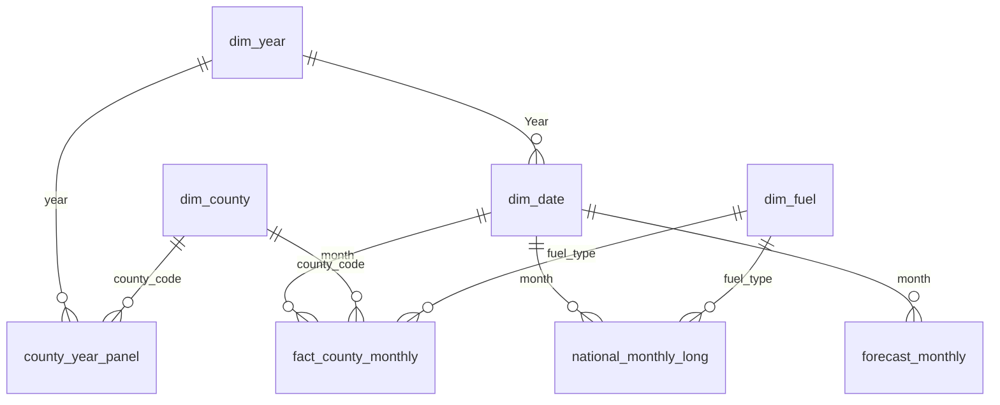

# Sweden's EV shift: private buyers stalled when the climate bonus ended, and are only now restarting

**Private buyers' battery-electric (BEV) share went from 21% (2021) to 39% (2022). It fell back to 32% for 2024–25 after the bonus ended, and is ~41% in 2026. The central forecast for 2028 is ~42%, not the 60%+ the bonus-era trend implied.**


## Key insights

**1. Ending the purchase bonus stopped private BEV growth for three years.** Under the climate bonus the private BEV share rose **+1.0 pp per month**. After it ended (8 Nov 2022) growth went flat (**+0.07 pp/month**), and the share fell from **38.8% (2022) to 31.6% (2024)**. Company buyers kept going and have led private buyers since 2023 (**44.0% vs 36.4%** that year). *(notebooks 01, 03)*

**2. National conditions matter far more than location.** Year effects explain **74%** of county-level variation. In 2025, only **11 pp** separated the top counties (Halland, Västerbotten, **35.3%**) from the bottom one (Värmland, **24.3%**). Within that, **+10% median income** goes with **+3.5 pp** BEV share. Sparse counties were the most bonus-dependent: they lost **0.9 pp more per halving of density** after the bonus ended. *(notebook 02)*

**3. The 2026 restart is real, but its future is uncertain.** Jan–Aug 2026 is **+8.8 pp** on the same months of 2025, driven by BEV volume (**+51%**) rather than a shrinking market. 2026 should end at about **41%**. For 2028, three scenarios give **38% / 42% / 49%** (downside / central / upside). No model saw the 2026 turn coming in backtests, so the ranges are wide on purpose. *(notebooks 01, 04)*

## Recommendation

**Plan for a private BEV share of about 40% in 2028, not a return to bonus-era growth.** To go well beyond that, **purchase price** is the lever. Any renewed incentive should **target sparsely populated counties**, where the bonus made the most difference. Watch the private rolling 12-month share: if it keeps rising through mid-2027, the 49% upside is in play.

## Tech stack


## Method

The data is official open data: **Trafikanalys** new registrations (2006 – Aug 2026; by county, fuel and owner type from 2021) and **SCB** population and income. The headline metric is **private buyers' BEV share**, a ratio of sums. It leaves out leasing cars, which are booked to the lessor's county.

| Notebook | Question | Method |
|---|---|---|
| [01 EDA](notebooks/01_eda.ipynb) | How fast? | Trends, rolling 12-month share, seasonality |
| [02 Regional](notebooks/02_regional.ipynb) | Where, and why? | 21-county panel regression with year fixed effects and clustered SEs |
| [03 Policy](notebooks/03_policy.ipynb) | Did the bonus end matter? | Interrupted time series (segmented regression, HAC and AR(1) errors) |
| [04 Forecast](notebooks/04_forecast.ipynb) | What's plausible by 2028? | State-space models on the logit share; two-origin backtest; simulated scenarios |

**Power BI data model** (star schema, built as a PBIP project with a TMDL model and a PBIR report):



All relationships are single-direction. One Year slicer filters both the monthly facts and the annual county panel through `dim_year`. Regression results and annual forecasts are standalone tables.

## Dashboard and outputs

- **Dashboard (PDF):** [docs/dashboard.pdf](docs/dashboard.pdf), five pages: Overview, Buyers & seasonality, Regional, What drives adoption, Forecast
- **Screenshots:** [overview](docs/screenshots/overview.png) · [buyers & seasonality](docs/screenshots/buyers-and-seasonality.png) · [regional](docs/screenshots/regional.png) · [what drives adoption](docs/screenshots/what-drives-adoption.png) · [forecast](docs/screenshots/forecast.png)
- **Notebooks:** [01 EDA](notebooks/01_eda.ipynb) · [02 Regional](notebooks/02_regional.ipynb) · [03 Policy](notebooks/03_policy.ipynb) · [04 Forecast](notebooks/04_forecast.ipynb)
- **Power BI project:** [powerbi/](powerbi/) (open `SwedenEV.pbip` in Power BI Desktop)

## How to reproduce

```powershell
py -3.12 -m venv .venv
.venv\Scripts\activate
pip install -r requirements.txt
python src/build_dataset.py          # raw downloads -> data/processed/ + SQLite
jupyter nbconvert --to notebook --execute --inplace notebooks/*.ipynb
python src/export_powerbi.py         # tables for Power BI -> powerbi/data/
```

Then open `powerbi/SwedenEV.pbip`. Set the **DataFolder** parameter (Home → Transform data ▾ → Edit parameters) to your local `powerbi/data/` path, then click **Refresh**.

## Limitations

- **Short post-bonus history:** 44 months containing one turning point, so the 2028 range is a set of scenarios, not a prediction.
- **Descriptive, not causal:** there are no price, charging or housing data, and county correlations don't describe individual households.
- **Private-buyer data starts in 2021**, and registrations aren't orders. Mobility Sweden's published shares differ slightly from these. Data notes: [data/SOURCES.md](data/SOURCES.md).
